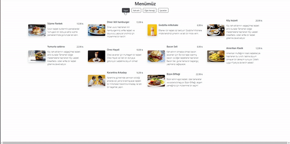

# Menu-Finder

I created menu-finder. In the design, I implemented the dynamics with JavaScript along with CSS and Bootstrap. 

As seen in the design, I created a responsive menu that can transform according to different screen sizes with content in different categories. 
I converted the contents into a file in JSON format and then imported it into a JavaScript file. 
Then, I completed the menu by separating the products according to their categories.

<h2>Used Tech.</h2> 
<ul>
  <li>HTML was used.</li>
  <li>CSS was used in design.</li>
  <li>Bootstrap was used in design.</li>
  <li>Javascript was used in dynamics.</li>
</ul>
<h2>Screen</h2>

